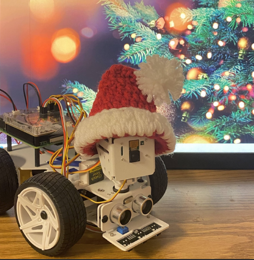

# Pi-CarX-Project
Using TCP networking and make the car move forward, backward, right and left with w, s, d, and a key. C key is stopping the car.

## Authors

- [@lallalamin](https://github.com/lallalamin)

## Documentation
We need to run "sudo bash i2samp.sh" on the car through RealVNC if you never run it before for the text-to-speech to work. Also, we need to install the keyboard by running “pip install keyboard” on the car, to make the keyboard listening work. We run the server file on RealVNC and the client file on the computer command prompt.  

Our team decided to do TCP networking and make the car move forward, backward, right and left with w, s, d, and a key. C key is stopping the car. In every direction or when the car stops, the car will either say “Running Forward”, “Backing Backing”, “Turning Right”, “Turning Left” or “I am stopping” according to what key the client press. The server will be waiting for the client to press the keys. Once the server gets the message key, it will perform actions like text-to-speech and Picar forwarding or turning the wheel for right and left.  

